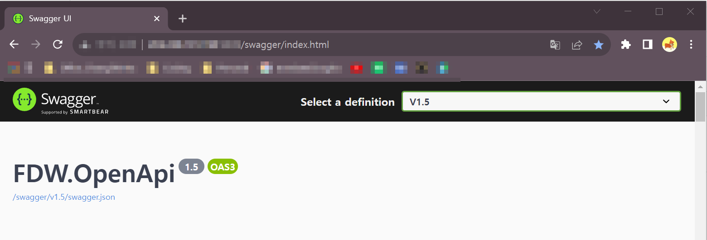
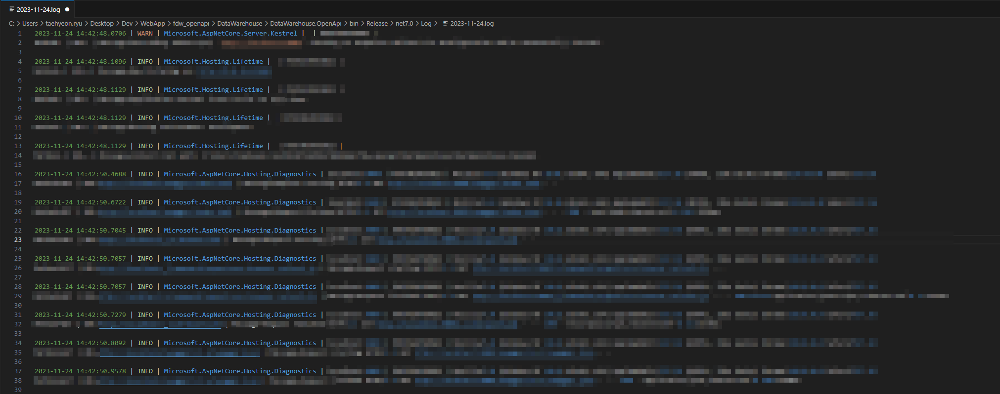

# FDW Open API

[](https://dotnet.microsoft.com/)
[](https://dotnet.microsoft.com/apps/aspnet)
[](https://docs.microsoft.com/ef/core/)
[](https://www.postgresql.org/)
[](https://www.jenkins.io/)
[](https://www.docker.com/)

Factory Data Warehouse (FDW) Open API - .NET Core 기반 데이터 웨어하우스 솔루션

## 📖 개요

FDW Open API는 공장 데이터를 RESTful API로 제공하는 데이터 웨어하우스 솔루션입니다.

### 주요 기능

- 📊 실시간 공장 데이터 조회 API
- 📥 다양한 포맷 파일 다운로드 (.json, .csv, .xml)
- 📝 NLog 기반 날짜별 로그 관리
- 🔄 Jenkins CI/CD 파이프라인 통합

## ⚙ CI/CD Pipeline with Jenkins

Jenkins URL : {JENKINS_URL}/job/FDW_OpenAPI/

## 🚀 Usage

### Get Data List Example

**Request:**

```bash
GET /v1/rtls/processinfo

curl -X 'GET' \
  '{OPENAPI_BASE_URL}/v1/rtls/processinfo' \
  -H 'accept: */*'
```

**Response:**

```http
api-supported-versions: 1
content-type: application/json; charset=utf-8
date: Tue,09 May 2023 00:25:07 GMT
server: Kestrel
transfer-encoding: chunked
```

### Get Data Example

**Request:**

```bash
GET /v1/rtls/processinfo/{process_loc}

curl -X 'GET' \
  '{OPENAPI_BASE_URL}/v1/rtls/processinfo/{process_loc}' \
  -H 'accept: */*'
```

**Response:**

```http
api-supported-versions: 1
content-type: application/json; charset=utf-8
date: Tue,09 May 2023 00:32:27 GMT
server: Kestrel
transfer-encoding: chunked
```

### Get Data File Download Example

**Request:**

```bash
GET /v1/rtls/processinfo.json

curl -X 'GET' \
  '{OPENAPI_BASE_URL}/v1/rtls/processinfo.json' \
  -H 'accept: */*'
```

**Response:**

```http
api-supported-versions: 1
content-disposition: attachment; filename=processinfo_list.json; filename*=UTF-8''processinfo_list.json
content-length: 13252
content-type: application/json
date: Thu,11 May 2023 00:05:30 GMT
server: Kestrel
```



### Log Sample



## 🏗️ 프로젝트 구조

```bash
fdw_api/
├── CSG.DAO/                      # Data Access Objects
├── CSG.DTO/                      # Data Transfer Objects
├── DataWarehouse.BLL/            # Business Logic Layer
├── DataWarehouse.EF/             # Entity Framework Core
├── DataWarehouse.OpenApi/        # ASP.NET Core Web API
├── DataWarehouse.OpenApi.Test/   # Unit Tests
└── DataWarehouse.sln             # Solution File
```

## 🤝 Contributing

Contributions, issues and feature requests are welcome.  
Feel free to check issues page if you want to contribute.

## 📝 License

Copyright © Changsin Inc. All rights reserved.
